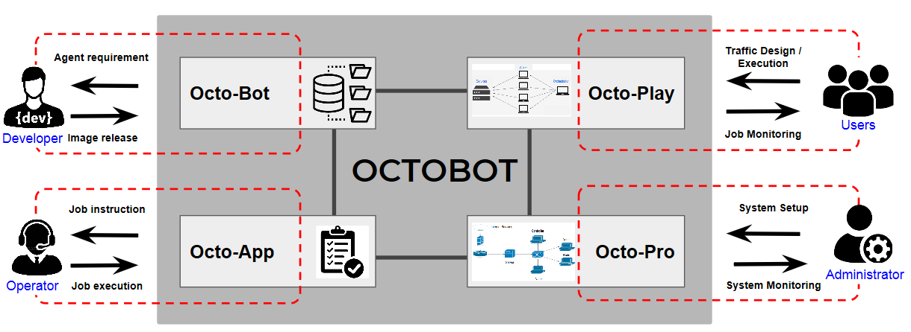

## OCTOBOT Architecture Design

### OCTOBOT High-level Design

The high-level view or architecture of OCTOBOT consists of 4 major components (i.e., Octo-Pro, Octo-
Play, Octo-App, and Octo-Bot) for different stakeholders with several sub-components:

1. The __*Octo-Pro*__ provides the provisioning mechanism for the system’s
administrator of the environment with automation capability and consistency
configuration.
2. The __*Octo-Play*__ provides the design and orchestration capability for the system’s
users to generate human-behave activity.
3. The __*Octo-Bot*__ provides the capability of developers to make their activity generator
logic based on specific human behavior, which is built into a standard image for
each bot.
4. The __*Octo-App*__ provides the interactive interface for the operator and also another
third-party software or system.

### Octo-Pro (OCTOBOT Provisioning System)

Provisioning preparation sub-component is required to install and configure the
requirement as defined in the main repository such as package installation
(Ansible, Python YAML ...), basic environment configuration (Python/BASH
environment, ...), and others. Environment file translator sub-component is
mixing the environment design input and pre-defined template which are ready
for the execution. Environment Setup executes several commands with several file
configuration such as Ansible with a playbook and host file and others.

### Octo-Play (OCTOBOT Orchestration System)

Orchestration preparation sub-component is required to install and configure the
requirement as defined in the main repository such as package installation
(Python Kubernetes API, Python YAML ...), basic environment configuration
(Python/BASH environment ...) and others. Activity file translator sub-component
is mixing the activity design input and pre-defined template which are ready for the
execution. Controller (container orchestrator) execute several API
calls/commands with several file configuration such as Kubernetes control with
activity deployment YAML file, and others.

### Octo-Bot (OCTOBOT Bot/Agent Development System)

Development preparation sub-component is required to install and configure the
requirement as defined in the main repository such as package installation
(Python PIP, IDE if required, Python interpreter, ...), basic environment
configuration (Python/BASH environment, ...) and others. Code compiler sub-
component is compiling the agent (bot) logic with several required libraries (in
can be integrated with IDE) which are ready for build by the Docker Builder with
specific Dockerfile. The builder tries to build the Docker image and publish or
lists in the local repository which is ready to run. However, it may also be pushed
to the Docker public repository for global usage. Another option to build the
Docker image is by pushing back the compiled code into the GitHub repository
then the Docker public repository can build automatically by linking and
configuring specific build trigger.

### Octo-App (OCTOBOT Application System)

Application preparation sub-component is required to install and configure the
requirement as defined in the main repository such as package installation
(Python Kubernetes API, UI bootstrap method ...), basic environment
configuration (Python/BASH/NPM environment ...) and others. Third-party user/application
interface sub-component is used to query the status of the worker and job running
on it, so it can be identified whether the worker ready to receive or complete some
jobs. Job file translator receives the job execution based on a specific schedule
and translates it into a deployment file which is ready for the execution.
Controller (container orchestrator) execute several API calls/commands with the
file such as Kubernetes control with activity deployment YAML file, and others.
