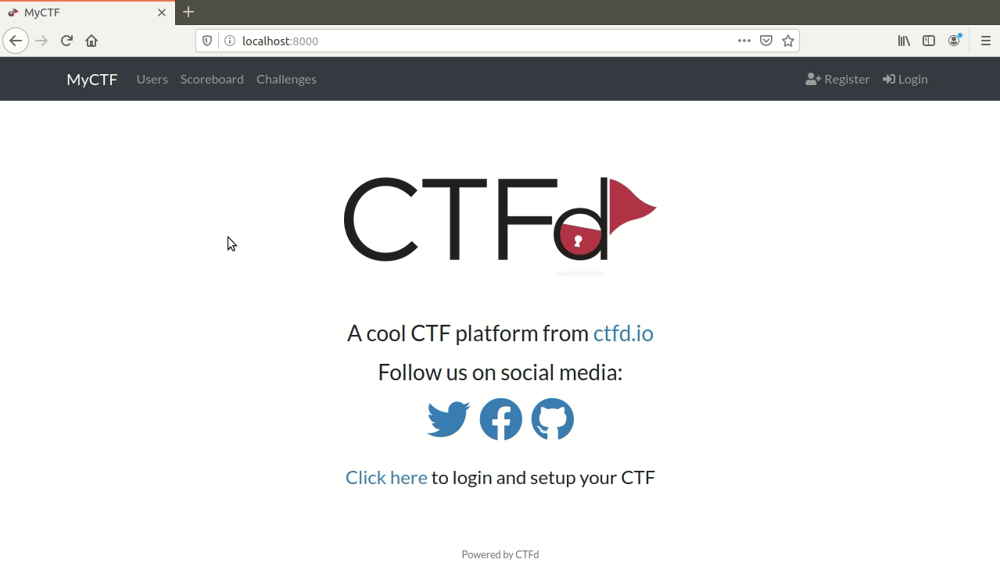
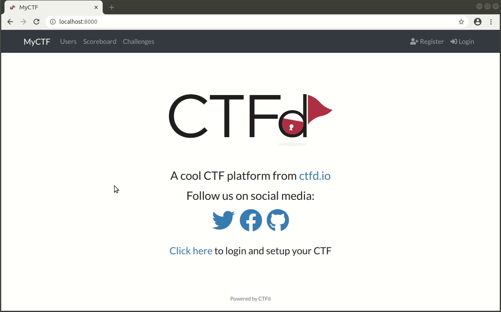

# Frequently Asked Questions (FAQ)
Question: How do I determine the CSS selector of elements

Answer: Most modern browsers support this feature. Open "inspect element" and hover over the intended element, right click and there should be a option to copy the css selector. Below shows some examples on some browsers.

**Firefox**


**Chrome**


##
Q: Why does my browser crash in docker container?

A: Try adding the ```--shm-size 2g``` or ```-v /dev/shm:/dev/shm``` to the ```docker run``` command ([More information here](https://github.com/SeleniumHQ/docker-selenium/pull/485)).